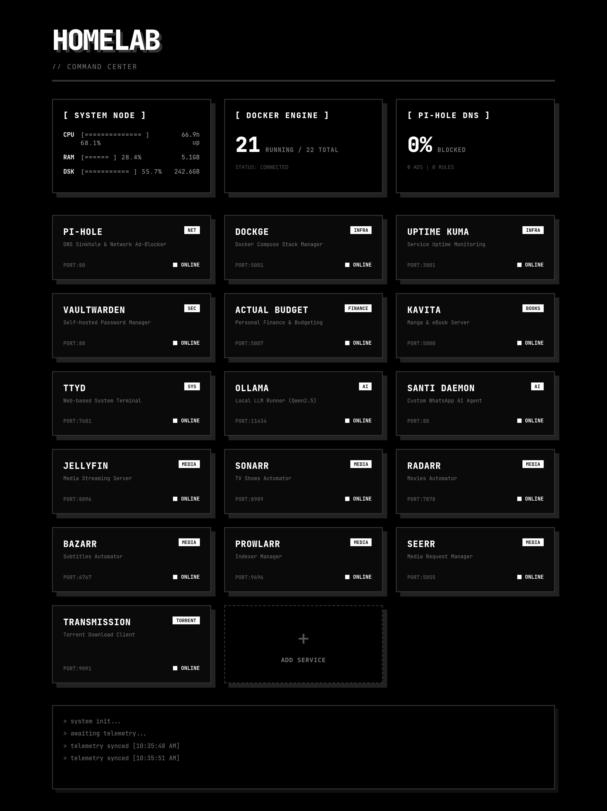
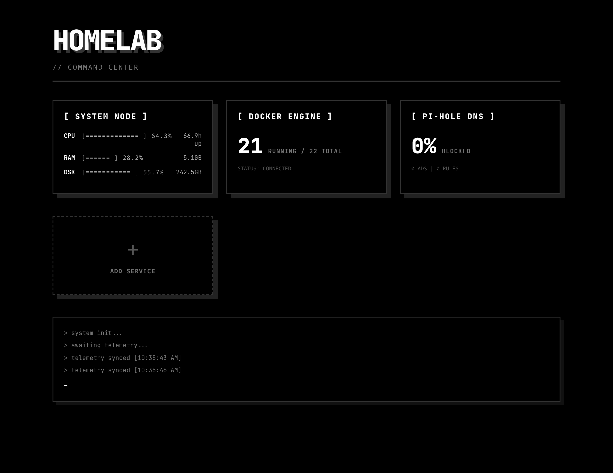

# OPENCODE // HOMELAB DASHBOARD

> A brutalist, ultra-minimalist, monochromatic dashboard for your homelab. 
Designed with strict aesthetics and raw functionality. No fluff, just data.

## // SHOWCASE

### Populated Dashboard (Example Setup)


### Clean Slate (Fresh Install)


## // FEATURES
* **Dynamic Configuration:** Add your services via the UI without touching the code.
* **Real-Time Telemetry:** Monitors your server's CPU, RAM, and Disk directly.
* **Docker Engine Sync:** Reads `/var/run/docker.sock` to display running containers.
* **Pi-Hole Integration:** Displays real-time ad-blocking metrics from your local Pi-hole.
* **Neo-Brutalist UI:** Hover and active states mimic physical mechanical switches. 

## // HOW TO IMPLEMENT IN YOUR HOMELAB

We built this to be completely "Plug & Play" using Docker. You don't need to know React or Python to install it.

### Step 1: Clone and Prepare
SSH into your server and clone this repository:
```bash
git clone https://github.com/YOUR_USERNAME/homelab-dash.git
cd homelab-dash
```

### Step 2: Spin it up
Run the Docker Compose command to build and start the dashboard in the background:
```bash
docker compose up -d --build
```
*Note: The dashboard runs on port `9000` by default. You can change this in the `docker-compose.yml` file.*

### Step 3: Customize via UI
1. Open your browser and go to `http://YOUR_SERVER_IP:9000`.
2. Scroll to the bottom and click the **[ + ADD SERVICE ]** block.
3. Fill in the modal with your service details (Name, Description, Tag, and URL).
4. The dashboard will instantly update and save your configuration permanently.

*Advanced:* You can also manually edit the `backend/config.json` file inside the directory.

## // STACK
* **Frontend:** React + Vite (Pure CSS Monochromatic OpenCode Theme)
* **Backend:** Python + FastAPI
* **Containerization:** Multi-stage Docker build

## // LICENSE
MIT
